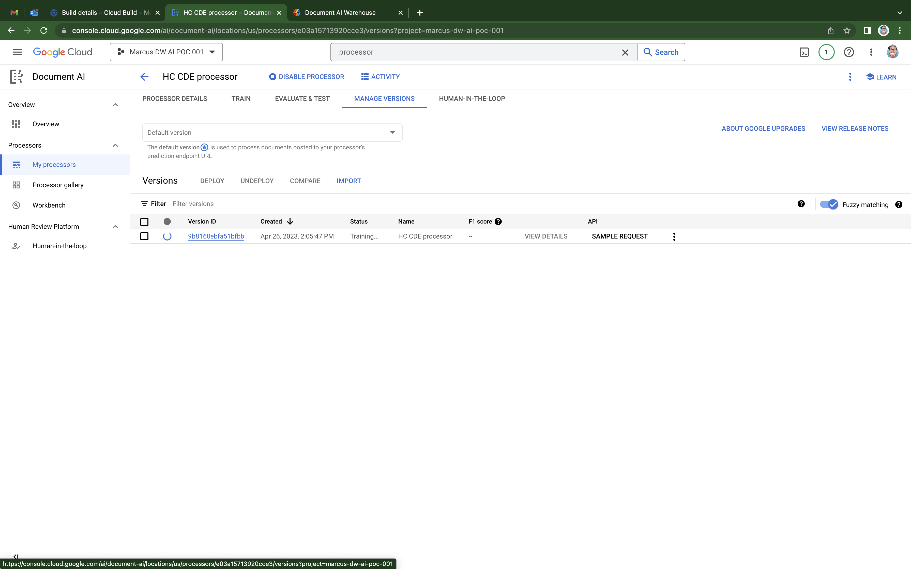

# DocAI Warehouse POC - Deployment Manual

## Pre-Requisites

1. Install [git](https://git-scm.com/book/en/v2/Getting-Started-Installing-Git).
1. Install [terraform](https://developer.hashicorp.com/terraform/downloads).
1. Install the [gcloud CLI](https://cloud.google.com/sdk/docs/install).
1. Join the [DW-UI-preview Group](https://groups.google.com/g/dw-ui-preview) to be able to access the Document AI Warehouse UI in your project.
1. Have a [Google Cloud Organization](https://cloud.google.com/resource-manager/docs/creating-managing-organization).
1. Have a [Billing Account](https://cloud.google.com/billing/docs/how-to/manage-billing-account).
1. [Create a Project](https://cloud.google.com/resource-manager/docs/creating-managing-projects#creating_a_project) to host the POC, linking it to a Billing Account.
1. If someone else other than the project's creator will deploy the system, then his/her user needs to be granted the `Owner` role in the project: the `Owner` role is [required to provision the Document AI Warehouse](https://cloud.google.com/document-warehouse/docs/quickstart#provision-cloud-console). Go to IAM & Admin -> IAM -> Click "Grant Access" for that.
1. If your organization has constraints on resource location, go to IAM & Admin -> Organization Policies -> Filter for `Google Cloud Platform - Resource Location Restriction` -> Click `Manage Policy`, and allow resources to be created in the regions you would like to deploy Document AI: at the moment, only the `us` and `eu` regions are supported.

## Bootstrap

1. Open a terminal.
1. Run `gcloud auth login`.
1. Run `gcloud application-default login`.
1. `cd` into the [bootstrap folder](../infra/deployment/terraform/bootstrap).
1. Run `cp terraform.tfvars.template terraform.tfvars` to create a [terraform.tfvars file](infra/deployment/terraform/bootstrap).
1. Set the variables in the `terraform.tfvars` file according to your own values. Leave the following variables empty for now:
    * `dw_ui_service_account_email`
    * `dw_ui_service_account_private_key`
    * `schema_id` 
    * `sourcerepo_name`

1. Comment out the entire contents of the `backend.tf` file.

1. Run `terraform init`.
1. Run `terraform apply -target=module.project`.
1. Uncomment the contents of the `backend.tf` and set the `bucket` attribute to the value of the `tfstate_bucket` output.

1. Run `terraform init` and type `yes` to store the [terraform state](https://developer.hashicorp.com/terraform/language/state) in the [Google Cloud Storage bucket](https://developer.hashicorp.com/terraform/language/settings/backends/gcs).
1. Follow the `doc_ai_warehouse_provisioning_link` on your web browser to manually create a DocAI Warehouse instance. [Reference documentation](https://cloud.google.com/document-warehouse/docs/quickstart#provision-cloud-console). Update the `dw_ui_service_account_email` and the `dw_ui_service_account_private_key` variables in the `terraform.tfvars` file.

1. Go to the Document AI Warehouse UI -> Admin -> Access and add your email as well as the `dw_ui_service_account_email` as a `Document Admin`s. If you have any other users or groups you would like to add you can also do it here.

1. Go to Document AI Warehouse UI -> Admin -> Schema, and create a [document schema](https://cloud.google.com/document-warehouse/docs/manage-document-schemas) using the [schema_creation.json](./data/schema_creation.json) file as the `json` input. Update the `schema_id` in the `terraform.tfvars` file.

1. [Create a Cloud Source Repository](https://cloud.google.com/source-repositories/docs/creating-an-empty-repository#gcloud) in the project your just created. Then push this repository to the newly created CSR repository. Update the `sourcerepo_name` variable in the `terraform.tfvars` file.

1. Go to Cloud Storage -> Settings and check that the `Cloud Storage Service Account` was created.

1. Run `terraform apply`.

## CDE Processor Training

1. Go to Cloud Build -> Triggers and run the `cde-processor-training` trigger.
1. Go to Document AI -> My processors -> Click `HC CDE processor` -> Click the `Manage Versions` tab, and wait for the processor training to finish successfully. This can take more than 30 minutes.
1. After the processor training has finished, click the three dots on the processor version row and [deploy the processor](https://cloud.google.com/document-ai/docs/manage-processor-versions#deploy).
1. [Set the deployed processor as default](https://cloud.google.com/document-ai/docs/manage-processor-versions#change-default).

## Test the Cloud Function

1. Go to Cloud Storage -> Click the `<my-project-id>-input-pdf` bucket -> Click `Upload Files` and upload the file you wish to process.
1. Go to DocAI Warehouse -> Click `All documents`: the processed document should be there.
1. In case of errors, go to Cloud Functions -> Click the `hc` Cloud Function -> Click the `Logs` tab to troubleshoot.

